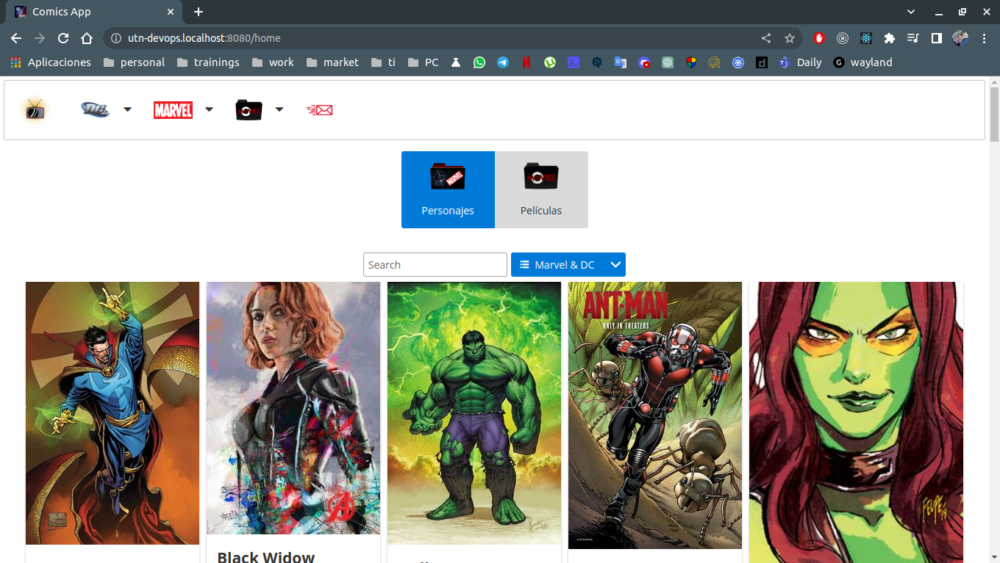
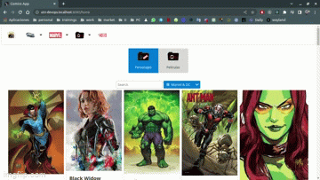

# DevOps, integración y agilidad continua 

## Actividad Grupal "Práctica 1"

- Para cada unidad encontrarán una guía detallada describiendo cada paso necesario para completar las prácticas. Su objetivo es guiar con ejemplos a los alumnos que se encuentren bloqueados con alguna consigna. Así mismo, cada alumno puede tener distintas o ninguna experiencia en el conjunto tecnológico que se brinda en este curso, por lo cual alentamos a que las prácticas se realicen en grupo y que al menos haya algún integrante que cuente con experiencia en desarrollo u operaciones.  

- Invitamos a los alumnos a que primero intenten resolver las consignas sin antes revisar la guía detallada y en los casos en que alguna tecnología sea de libre elección (esto se aclarará en cada consigna) opten por la que se sientan más cómodos. Por ejemplo, en la creación de una aplicación en lugar de ser en lenguaje PHP podría ser en React, Node.js, Go, etc. siempre y cuando cumpla con el objetivo de la consigna.

## Actividad

- Esta actividad debe ser realizada con su equipo, si no tiene uno averigüe y únase a uno.

- Reunido con  el equipo (virtual o presencial), pueden optar por entregar la práctica detallada o exploratoria. Los pasos a seguir se encuentran en los respectivos archivos: Práctica detallada, Práctica exploratoria .
Para consultas a docente, debe hacerlo una persona por equipo, indicando el nombre del equipo, en el Foro de Consulta a Docentes.
La entrega es una por equipo solamente, en este espacio. Si optaron por realizar la práctica detallada, de no especificarse en el archivo lo que deberán entregar es una impresión de pantalla del último punto de la práctica. 
Para la práctica exploratoria se indica en el archivo qué entregar.
Sugerencia: Para generar el espacio colaborativo donde puedan compartir pantalla y conversar, recomendamos usar Zoom.

- Atención :  No se pueden hacer entregas individuales. En el caso de considerar necesario cambio de equipo, es responsabilidad de cada uno autogestionarlo, están habilitados para hacerlo. La única calificación que existe es "1" que significa entregado.

- No es necesario la realización de las dos prácticas. Sólo revisaremos una de ellas.

## Entregables:

1. URLs de los 2 repositorios git:
  * Repositorio de la actividad principal (DevOps): https://github.com/leandrojaviercepeda/m1u2-devops-utn/tree/unidad-1-vagrant
  * Repositorio frontend de la aplicacion: https://github.com/leandrojaviercepeda/comics-web-dpwfsrjs-utn
  * Repositrio backend de la aplicacion: https://github.com/leandrojaviercepeda/comics-api-dpwfsrjs-utn
  * Registry DockerHub de frontend: https://hub.docker.com/repository/docker/leandrojaviercepeda/comics-web-dpwfsrjs-utn/general
  * Registry DockerHub de backend: https://hub.docker.com/repository/docker/leandrojaviercepeda/comics-api-dpwfsrjs-utn/general

2. Para el repositorio de la aplicación indicar branch y ruta del archivo que posee el contenido que se mostrará en el navegador.
  * Pagina Home de la aplicacion: https://github.com/leandrojaviercepeda/comics-web-dpwfsrjs-utn/blob/develop/src/components/Home/Home.js

3. Captura  de  pantalla  del  navegador  consumiendo  la  aplicación  dentro  la  VM  de Ubuntu.
  * Imagen: 
  * Gif: 

4. Presentar  los  entregables  en  único  archivo  con  el  nombre: NOMBRE  EQUIPO - Practica 1. Sólo una entrega por equipo.
  * [Archivo](./leandro-cepeda-equipo-7-practica-1.pdf)