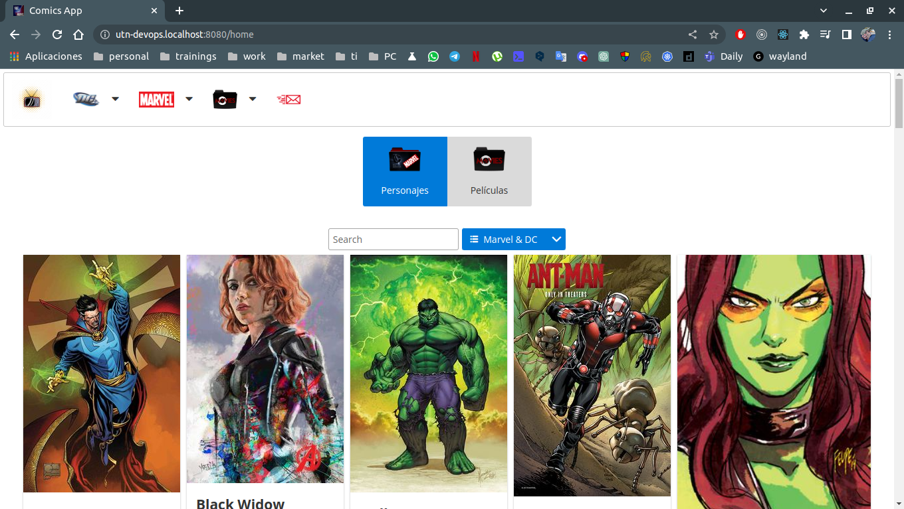

# DevOps, integración y agilidad continua

## Actividad Grupal "Práctica 2"

Para cada unidad encontrarán una guía detallada describiendo cada paso necesario para completar las prácticas. Su objetivo es guiar con ejemplos a los alumnos que se encuentren bloqueados con alguna consigna. Así mismo, cada alumno puede tener distintas o ninguna experiencia en el conjunto tecnológico que se brinda en este curso, por lo cual alentamos a que las prácticas se realicen en grupo y que al menos haya algún integrante que cuente con experiencia en desarrollo u operaciones.  

Invitamos a los alumnos a que primero intenten resolver las consignas sin antes revisar la guía detallada y en los casos en que alguna tecnología sea de libre elección (esto se aclarará en cada consigna) opten por la que se sientan más cómodos. Por ejemplo, en la creación de una aplicación en lugar de ser en lenguaje PHP podría ser en React, Node.js, Go, etc. siempre y cuando cumpla con el objetivo de la consigna.

## Actividad

- Esta actividad debe ser realizada con su equipo, si no tiene uno averigüe y únase a uno.

- Reunido con  el equipo (virtual o presencial), pueden optar por entregar la práctica detallada o exploratoria. Los pasos a seguir se encuentran en los respectivos archivos: Práctica detallada, Práctica exploratoria .
Para consultas a docente, debe hacerlo una persona por equipo, indicando el nombre del equipo, en el Foro de Consulta a Docentes.
La entrega es una por equipo solamente, en este espacio. Si optaron por realizar la práctica detallada, de no especificarse en el archivo lo que deberán entregar es una impresión de pantalla del último punto de la práctica. 
Para la práctica exploratoria se indica en el archivo qué entregar.
Sugerencia: Para generar el espacio colaborativo donde puedan compartir pantalla y conversar, recomendamos usar Zoom.

- Atención :  No se pueden hacer entregas individuales. En el caso de considerar necesario cambio de equipo, es responsabilidad de cada uno autogestionarlo, están habilitados para hacerlo. 

- La única calificación que existe es "1" que significa entregado.

- No es necesario la realización de las dos prácticas. Sólo revisaremos una de ellas.

## Entregables:

1. URLs de los 2 repositorios git:
  * Repositorio de la actividad principal (DevOps): https://github.com/leandrojaviercepeda/m1u2-devops-utn/tree/unidad-2-docker
  * Repositorio frontend de la aplicacion: https://github.com/leandrojaviercepeda/comics-web-dpwfsrjs-utn
  * Repositrio backend de la aplicacion: https://github.com/leandrojaviercepeda/comics-api-dpwfsrjs-utn
  * Registry DockerHub de frontend: https://hub.docker.com/repository/docker/leandrojaviercepeda/comics-web-dpwfsrjs-utn/general
  * Registry DockerHub de backend: https://hub.docker.com/repository/docker/leandrojaviercepeda/comics-api-dpwfsrjs-utn/general

2. Para el repositorio de la aplicación indicar branch y una breve explicación  de  qué  dato  se  consumirá  en  la  base  de  datos.  Esto se utilizará para hacer una coincidencia con la captura del navegador del punto siguiente:

  * Pagina Home de la aplicacion: https://github.com/leandrojaviercepeda/comics-web-dpwfsrjs-utn/blob/develop/src/components/Home/Home.js
  * Script (frontend) con logica de solicitud HTTP GET (linea 13 a linea 27): https://github.com/leandrojaviercepeda/comics-web-dpwfsrjs-utn/blob/develop/src/components/Characters/CharsList.js
  * Script (backend) con logica de solicitud de datos a la BBDD comics TABLA charact (linea 4 a linea 18): https://github.com/leandrojaviercepeda/comics-api-dpwfsrjs-utn/blob/develop/src/characterModel.js
  * Docker Compose (docker-compose.yml) con servicios requeridos para el proyecto: https://github.com/leandrojaviercepeda/m1u2-devops-utn/blob/unidad-2-docker/docker/docker-compose.yml
  * En la pagina Home del sitio web se se realiza una solicitud HTTP GET a una API (comics-api/servidor express de backend) a un endpoint, dicho endpoint tiene la logica integrada para consumir los datos de personajes (TABLA charact de BBDD comics) de una base de datos mysql, luego estos son enviados al cliente (aplicacion frontend ReactJS) para ser presentados.

  * Para verificar que efectivamente existe un contenedor docker con mysql y un volumen creado para la persistencia de los datos de la BBDD corriendo en la VM se ejecutaron los siguientes comandos:

  - Comando para visualizar contenedores:
  ```
  vagrant@utn-devops:~$ sudo docker ps -a
  ```

  - Salida del comando anterior:
  ```
  CONTAINER ID  IMAGE COMMAND CREATED STATUS  PORTS NAMES
  f5deced39d7e  leandrojaviercepeda/comics-web-dpwfsrjs-utn:develop-latest  "nginx -g 'daemon of…"  2 minutes ago Up 2 minutes  80/tcp, 0.0.0.0:8080->8080/tcp, :::8080->8080/tcp comics-web
  7d69724e8d88  leandrojaviercepeda/comics-api-dpwfsrjs-utn:develop-latest  "npm start" 2 minutes ago Up 2 minutes  0.0.0.0:4000->4000/tcp, :::4000->4000/tcp comics-api
  82713c741a08  mysql "docker-entrypoint.s…"  2 minutes ago Up 2 minutes  0.0.0.0:3306->3306/tcp, :::3306->3306/tcp, 33060/tcp  comics-db
  ```

  - Comando para visualizar los volumenes existentes (volumen mysql):
  ```
  vagrant@utn-devops:~$ sudo docker volume ls
  ```

  - Salida del comando anterior:
  ```
  DRIVER    VOLUME NAME
  local     comics_mysql-data
  ```

  * Para verificar que efectivamente existe una BBDD comics con una tabla charact dentro del contenedor docker con mysql corriendo en la VM se ejecutaron los siguientes comandos:

  - Comando para conectarse al contenedor docker mysql
  ```
  vagrant@utn-devops:~$ sudo docker exec -it comics-db bash
  ```

  - Comando para conectarse a la BBDD mysql
  ```
  bash-4.4# mysql --user=root --password=2b67766ac41415ec93a07df1ada9b2b5
  ```

  - Salida del comando anterior:
  ```
  mysql: [Warning] Using a password on the command line interface can be insecure.
  Welcome to the MySQL monitor.  Commands end with ; or \g.
  Your MySQL connection id is 8
  Server version: 8.0.33 MySQL Community Server - GPL

  Copyright (c) 2000, 2023, Oracle and/or its affiliates.

  Oracle is a registered trademark of Oracle Corporation and/or its
  affiliates. Other names may be trademarks of their respective
  owners.

  Type 'help;' or '\h' for help. Type '\c' to clear the current input statement.

  mysql> 
  ```

  - Comando para visualizar bases de datos:
  ```
  mysql> show databases;
  ```

  - Salida del comando anterior:
  ```
  +--------------------+
  | Database           |
  +--------------------+
  | comics             |
  | information_schema |
  | mysql              |
  | performance_schema |
  | sys                |
  +--------------------+
  5 rows in set (0.00 sec)
  ```

  - Comando para visualizar el esquema de la TABLA charact de la BBDD comics:
  ```
  mysql> describe comics.charact;
  ```

  - Salida del comando anterior:
  ```
  +--------------------+--------------+------+-----+---------+----------------+
  | Field              | Type         | Null | Key | Default | Extra          |
  +--------------------+--------------+------+-----+---------+----------------+
  | id_charact         | int          | NO   | PRI | NULL    | auto_increment |
  | name               | varchar(250) | YES  |     | NULL    |                |
  | character_name     | varchar(250) | YES  |     | NULL    |                |
  | year_of_appearance | varchar(250) | YES  |     | NULL    |                |
  | house              | varchar(250) | YES  |     | NULL    |                |
  | biography          | text         | YES  |     | NULL    |                |
  | equipment          | json         | YES  |     | NULL    |                |
  | amount_images      | varchar(250) | YES  |     | NULL    |                |
  | images             | json         | YES  |     | NULL    |                |
  | movies             | json         | YES  |     | NULL    |                |
  +--------------------+--------------+------+-----+---------+----------------+
  10 rows in set (0.00 sec)
  ```

3. Captura  de  pantalla  del  navegador  consumiendo  la  aplicación  dentro  la  VM  de Ubuntu.
  * Imagen: 
  * Gif: 

4. Presentar  los  entregables  en  único  archivo  con  el  nombre: NOMBRE  EQUIPO - Practica 1. Sólo una entrega por equipo.
  * [Archivo](./leandro-cepeda-equipo-7-practica-2.pdf)