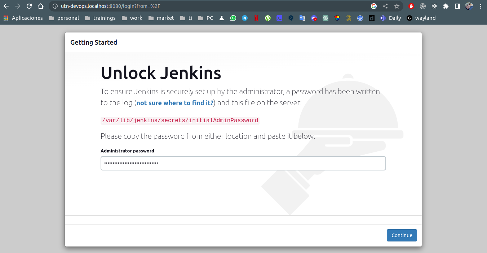

# DevOps, integración y agilidad continua

## Actividad Grupal "Práctica 5"

Para cada unidad encontrarán una guía detallada describiendo cada paso necesario para completar las prácticas. Su objetivo es guiar con ejemplos a los alumnos que se encuentren bloqueados con alguna consigna. Así mismo, cada alumno puede tener distintas o ninguna experiencia en el conjunto tecnológico que se brinda en este curso, por lo cual alentamos a que las prácticas se realicen en grupo y que al menos haya algún integrante que cuente con experiencia en desarrollo u operaciones.  

Invitamos a los alumnos a que primero intenten resolver las consignas sin antes revisar la guía detallada y en los casos en que alguna tecnología sea de libre elección (esto se aclarará en cada consigna) opten por la que se sientan más cómodos. Por ejemplo, en la creación de una aplicación en lugar de ser en lenguaje PHP podría ser en React, Node.js, Go, etc. siempre y cuando cumpla con el objetivo de la consigna.

## Actividad

Esta actividad debe ser realizada con su equipo, si no tiene uno averigüe y únase a uno.

Reunido con  el equipo (virtual o presencial), pueden optar por entregar la práctica detallada o exploratoria. Los pasos a seguir se encuentran en los respectivos archivos: Práctica detallada, Práctica exploratoria .
Para consultas a docente, debe hacerlo una persona por equipo, indicando el nombre del equipo, en el Foro de Consulta a Docentes.
La entrega es una por equipo solamente, en este espacio. Si optaron por realizar la práctica detallada, de no especificarse en el archivo lo que deberán entregar es una impresión de pantalla del último punto de la práctica. 
Para la práctica exploratoria se indica en el archivo qué entregar.
Sugerencia: Para generar el espacio colaborativo donde puedan compartir pantalla y conversar, recomendamos usar Zoom.

Atención :  No se pueden hacer entregas individuales. En el caso de considerar necesario cambio de equipo, es responsabilidad de cada uno autogestionarlo, están habilitados para hacerlo. La única calificación que existe es "1" que significa entregado.

No es necesario la realización de las dos prácticas. Sólo revisaremos una de ellas.

## Consigna
El objetivo de esta práctica consistirá en configurar Jenkins pipeline en la mayor medida de lo posible mediante un Jenkinsfile alojado en un repositorio de código.

* Se deberá completar lo siguiente:
  - Los archivos de infraestructura deben estar versionados en un branch con el nombre “unidad-4-jenkins”, se debe crear a partir de los últimos cambios del branch “unidad-3-puppet”. Proyecto “utn-devops”.
  - Se deberá utilizar Jenkins Pipelines.
  - Se deberá versionar el archivo Jenkinsfile en el repositorio unidad-4-jenkins .
  - Se deberán obtener los cambios en un repositorio de aplicación y que jenkins ejecute al menos una prueba unitaria de dicha aplicación. Puede ser al realizar el merge o por pull-request.

## Entregables:
1. URLs de los 2 repositorios git. Indicar directorio en donde se almacenan los archivos que se utilizarán, manifiestos de Puppet:
  * Repositorio de la actividad principal: https://github.com/leandrojaviercepeda/utn-devops/tree/unidad-4-jenkins/m1u5
  * Repositorio, directorio de manifiestos de Puppet: https://github.com/leandrojaviercepeda/utn-devops/tree/unidad-4-jenkins/m1u5/puppet
  * Repositorio de aplicacion: https://github.com/IvanAntoff/testing-react-with-jest

2. Capturas de pantalla indicadas para mostrar las evidencias, además se debe incluir la visualización del pipeline y la ejecución de un build.
  * Pantalla de creacion de usuario administrador: 
    - Se ejecutaron los siguientes comandos para obtener el password del usuario Jenkins:
      1. Comando para conectarse por ssh a la VM:
      ```
      $ vagrant ssh
      ``` 

      2. Comando para obtener el password de Jenkins:
      ```
      $ sudo cat /var/lib/jenkins/secrets/initialAdminPassword
      ```

  * Establecemos usuario Jenkins como: admin
  * Establecemos contraseña de usuario Jenkins como: utndevops

  * Pantalla de plugins instalados: 
  * Pantalla de registro de usuario: 
  * Pantalla de definicion del host: 
  * Pantalla de inicio Jenkins: 
  * Pantalla de visualización del pipeline: 
  * Pantalla de ejecución del build: 

3. Presentar los entregables en único archivo con el nombre: NOMBRE EQUIPO. Practica 4 exploratoria. Sólo una entrega por equipo.
  * [Archivo](./leandro-cepeda-equipo-7-practica-4.pdf)